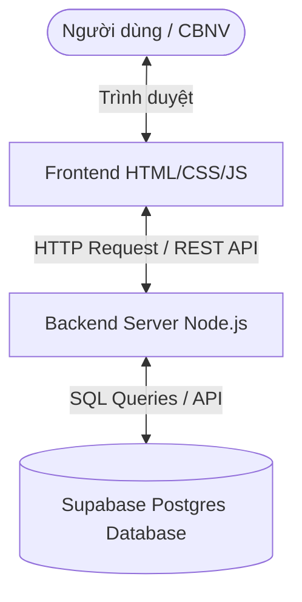
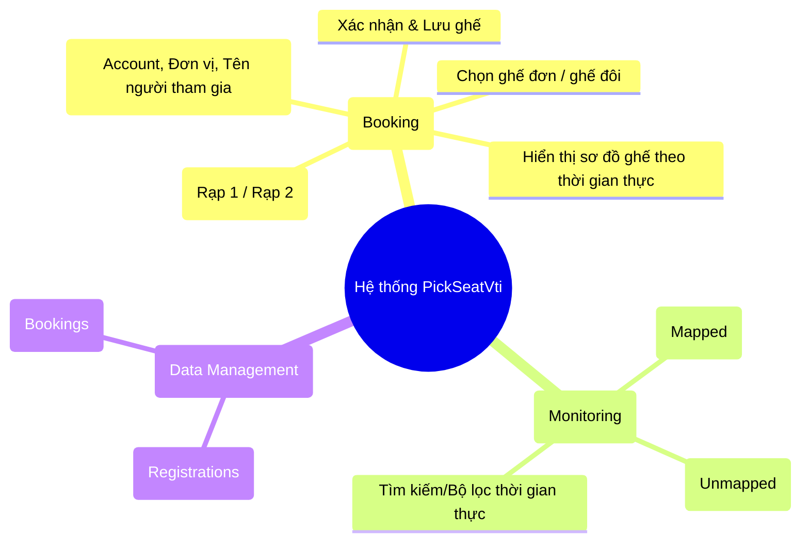

# TÀI LIỆU THIẾT KẾ CƠ BẢN (BASIC DESIGN) - DỰ ÁN PICKSEATVTI

Dự án **PickSeatVti** là một ứng dụng web gọn nhẹ (Lightweight Web Application) hỗ trợ CBNV (Cán bộ nhân viên) của VTI thực hiện đăng ký và tự chọn ghế ngồi cho bản thân và người thân trong sự kiện xem phim của công ty. Đồng thời, hệ thống cung cấp tính năng đối soát dữ liệu (Monitoring) để quản trị viên theo dõi tiến độ và kiểm tra tính hợp lệ của việc chọn ghế.

---

## 1. Tổng quan hệ thống (System Overview)

Hệ thống được thiết kế theo mô hình **Client-Server** tối giản, sử dụng Node.js làm máy chủ backend (không phụ thuộc vào các web framework nặng nề như Express) và HTML/CSS/JS thuần cho giao diện người dùng frontend. Dữ liệu được lưu trữ tập trung trực tuyến trên dịch vụ đám mây **Supabase Database (PostgreSQL)**.



### Đối tượng sử dụng
*   **CBNV VTI**: Truy cập giao diện để thực hiện chọn vị trí ghế cho mình và người thân đi kèm.
*   **Quản trị viên (Admin / BTC)**: Sử dụng giao diện Monitoring để theo dõi danh sách, tìm kiếm và đối soát dữ liệu ghế đã đặt so với danh sách đăng ký ban đầu.

---

## 2. Kiến trúc chức năng (Functional Architecture)

Hệ thống bao gồm các phân hệ chức năng chính sau:



### 2.1. Phân hệ đặt ghế (Cinema Seating Page)
*   **Sơ đồ ghế trực quan**: Hiển thị sơ đồ ghế của Cinema 1 và Cinema 2. Hỗ trợ hiển thị các trạng thái ghế khác nhau: *Ghế chưa chọn, Ghế đã chọn (khóa), Ghế đôi (couple), Ghế đang chọn*.
*   **Đăng ký thông tin**: Khi người dùng chọn ghế và nhấn "Save", một hộp thoại (modal) sẽ xuất hiện yêu cầu nhập:
    *   Tài khoản CBNV (Account)
    *   Đơn vị (Unit)
    *   Họ và tên của từng người tương ứng với từng ghế đã chọn.
*   **Ràng buộc & Validate (Backend)**:
    *   Tài khoản CBNV phải tồn tại trong danh sách đăng ký ban đầu.
    *   Số lượng ghế đặt không được vượt quá số lượng đăng ký tối đa cho phép (CBNV + Người thân đi kèm).
    *   Ghế được đặt phải còn trống (chưa bị người khác đặt).

### 2.2. Phân hệ đối soát (Monitoring Page)
*   **Danh sách đối soát chuẩn (Mapped Rows)**: Hiển thị thông tin những người tham gia đã đăng ký ban đầu kèm theo ghế và rạp tương ứng mà họ đã chọn.
*   **Danh sách không có trong đăng ký ban đầu (Unmapped Rows)**: Hiển thị những trường hợp đã đặt ghế thành công trên hệ thống nhưng thông tin (Account hoặc Họ tên) không khớp với dữ liệu đăng ký ban đầu (nhằm phát hiện các trường hợp đặt sai thông tin).
*   **Bộ lọc tìm kiếm**: Cho phép tìm kiếm nhanh theo Tên, Account, Đơn vị, Rạp hoặc Số ghế trực tiếp trên giao diện.

---

## 3. Thiết kế luồng dữ liệu (Workflow & Sequence Diagrams)

### 3.1. Luồng Đăng ký & Đặt ghế (Booking Workflow)

Dưới đây là trình tự hoạt động khi người dùng tiến hành chọn ghế và xác nhận đặt ghế:

```mermaid
sequenceDiagram
    actor User as Người dùng
    participant FE as Frontend (JS)
    participant BE as Backend (Node.js)
    database DB as Supabase (PostgreSQL)

    User->>FE: Chọn ghế trên sơ đồ
    User->>FE: Nhấn "Save"
    FE->>User: Hiển thị Modal nhập Account, Đơn vị, Họ tên người tham gia
    User->>FE: Điền thông tin & Nhấn "Xác nhận"
    FE->>BE: POST /api/validate-booking (Cinema, Account, Unit, Attendees)
    
    note over BE: Thực hiện kiểm tra nghiệp vụ
    BE->>DB: SELECT chi tiết đăng ký & đếm số ghế đã đặt
    alt Tài khoản chưa đăng ký sự kiện
        BE-->>FE: Trả về { valid: false, message: "CBNV chưa đăng ký..." }
        FE-->>User: Hiển thị thông báo lỗi trên Modal
    else Vượt quá số lượng ghế đăng ký
        BE-->>FE: Trả về { valid: false, message: "Vượt quá số lượng..." }
        FE-->>User: Hiển thị thông báo lỗi trên Modal
    else Ghế đã bị người khác đặt trước
        BE-->>FE: Trả về { valid: false, message: "Ghế đã được đăng ký." }
        FE-->>User: Hiển thị thông báo lỗi trên Modal
    else Thông tin hợp lệ
        BE->>DB: INSERT dữ liệu đặt ghế mới vào bảng bookings
        BE-->>FE: Trả về { valid: true, seats: [...] }
        FE->>FE: Cập nhật sơ đồ ghế (Đổi màu sang Đã chọn)
        FE->>FE: Đóng Modal
        FE-->>User: Đăng ký thành công
    end
```

### 3.2. Luồng Đối soát Dữ liệu (Monitoring Workflow)

Khi quản trị viên truy cập trang Monitoring để theo dõi tình hình đặt ghế:

```mermaid
sequenceDiagram
    actor Admin as Quản trị viên
    participant FE as Frontend (monitoring.js)
    participant BE as Backend (server.js)
    database DB as Supabase (PostgreSQL)

    Admin->>FE: Truy cập trang monitoring.html
    FE->>BE: GET /api/monitoring
    BE->>DB: SELECT * FROM registrations & bookings
    
    note over BE: Đối chiếu (Map) danh sách:
    note over BE: 1. Ghép nối thông tin bookings với registrations qua Account & Name
    note over BE: 2. Gom các bookings không trùng khớp vào danh sách Unmapped
    
    BE-->>FE: Trả về { mappedRows, unmappedRows }
    FE->>FE: Render 2 bảng dữ liệu lên giao diện
    FE-->>Admin: Hiển thị danh sách đối soát trực quan
```

---

## 4. Thiết kế dữ liệu cơ bản (Data Design)

Hệ thống sử dụng dịch vụ cơ sở dữ liệu Supabase Database (PostgreSQL) thay thế cho các tệp tin lưu trữ cục bộ:

1.  **Bảng Đăng ký (`registrations`)**: Lưu trữ thông tin định danh của CBNV và danh sách người thân đã đăng ký trước sự kiện. Khóa chính là cột `account` (tài khoản viết thường).
2.  **Bảng Đặt ghế (`bookings`)**: Lưu trữ thông tin vị trí ghế đã chọn thực tế theo thời gian thực. Bảng thiết lập ràng buộc duy nhất `UNIQUE(cinema, seat)` để phòng ngừa đặt trùng ghế.

---

## 5. Thiết kế giao diện cơ bản (UI Design)

Hệ thống được thiết kế với giao diện tối giản, tập trung vào sơ đồ ghế rạp chiếu phim (Cinema Seating Layout) trực quan:
*   **Trang Cinema**: Có 2 trang tương ứng cho Cinema 1 và Cinema 2. Sơ đồ ghế chiếm diện tích trung tâm, phía dưới là chú thích màu sắc của ghế (Đã chọn, Ghế đôi, Chưa chọn, Đang chọn) và các nút điều hướng cơ bản (*Save*, *Danh sách đối soát*, *Chuyển rạp*).
*   **Trang Monitoring**: Bố cục dạng bảng (Table layout) khoa học. Chia làm hai vùng rõ rệt: Bảng đối soát chính và Bảng hiển thị các trường hợp không khớp (Unmapped) để Admin dễ dàng kiểm tra.
