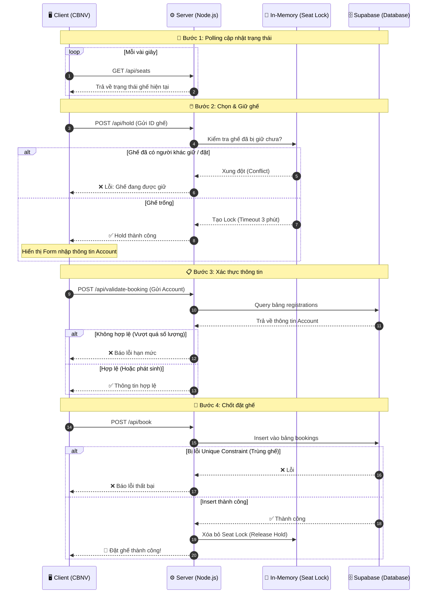

# Sơ đồ luồng hoạt động dự án vti-pick-seat

Dưới đây là sơ đồ chi tiết mô tả luồng hoạt động của hệ thống đặt ghế và quá trình quản lý đối soát của Ban Tổ Chức (BTC).

## 1. Sơ đồ tuần tự (Sequence Diagram) - Luồng đặt ghế của Cán bộ nhân viên (CBNV)

Sơ đồ này thể hiện chi tiết quá trình từ lúc người dùng xem trạng thái ghế, chọn ghế, đến khi hoàn tất lưu dữ liệu xuống Database.



## 2. Sơ đồ khối (Flowchart) - Luồng Quản lý và Đối soát của Ban Tổ Chức

Sơ đồ này thể hiện cách BTC theo dõi trạng thái, đối soát tài khoản và xử lý các sự cố (hủy ghế).

```mermaid
flowchart TD
    %% Định nghĩa các Actor và Component
    BTC((Ban Tổ Chức))
    MonitorUI[💻 Màn hình Monitoring\n(/monitoring.html)]
    ViewUI[📺 Màn hình sảnh chờ\n(/view-cinema.html)]
    Server[⚙️ Server API\n(Node.js)]
    DB[(🗄️ Supabase DB)]

    %% Luồng xem rạp ngoài sảnh
    BTC -. Trình chiếu .-> ViewUI
    ViewUI -- "GET /api/seats\n(Real-time polling)" --> Server

    %% Luồng quản lý
    BTC ==>|Truy cập bảng điều khiển| MonitorUI
    MonitorUI == "GET /api/monitoring" ==> Server
    Server == "Query dữ liệu\n(Registrations + Bookings)" ==> DB
    DB == "Trả về danh sách" ==> Server
    Server == "Hiển thị dữ liệu\n- Danh sách đặt\n- Tài khoản phát sinh" ==> MonitorUI

    %% Luồng xử lý sự cố (Hủy ghế)
    BTC -- "Yêu cầu xóa lượt đặt\n(sai sót, đổi ý)" --> MonitorUI
    MonitorUI -- "DELETE /api/booking/:id" --> Server
    Server -- "Xóa Record trong bảng bookings" --> DB
    Server -. "Cập nhật lại trạng thái" .-> MonitorUI
```
